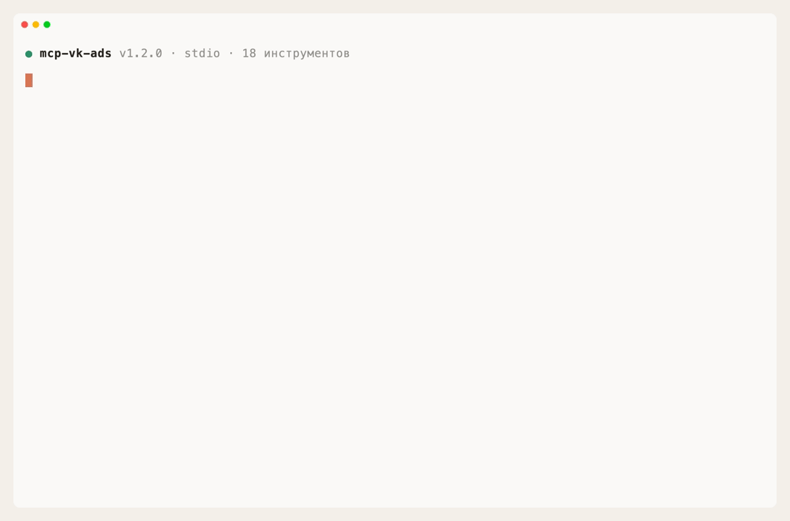

# VK Ads MCP

[](https://www.npmjs.com/package/mcp-vk-ads) [](https://github.com/askads/mcp-vk-ads/actions/workflows/ci.yml) [](https://glama.ai/mcp/servers/askads/mcp-vk-ads) [](./LICENSE)

MCP-сервер для **VK Рекламы (VK Ads)**: управляйте рекламой из Claude, Cursor, Codex и других AI-клиентов на естественном языке.

Ассистент сам собирает данные из статистики, кампаний, групп и объявлений, находит закономерности и вносит правки — то, что в кабинете VK Ads приходится делать вручную и по одному экрану.



<sub>Настоящая MCP-сессия: реальный сервер, хендшейк и tools/call по stdio через официальный SDK; ответы VK Ads — записанные фикстуры (<a href="docs/demo">docs/demo</a>), поэтому демо воспроизводится без токена и сети — <a href="docs/demo.tape">vhs docs/demo.tape</a>.</sub>

## Быстрый старт

1. [Получите токен](#получение-токена) — `client_id`/`client_secret` из кабинета VK Ads + один curl.
2. Добавьте сервер — например, в Claude Code ([другие клиенты](#установка)):

   ```bash
   claude mcp add vk-ads -e VK_ADS_TOKEN=ваш_токен -- npx -y mcp-vk-ads@latest
   ```

3. Спросите ассистента: «Покажи статистику по кампаниям за последние 7 дней».

## Что умеет

- **Кампании, группы, объявления** — рекламные планы (`ad_plans`), группы (`ad_groups`) и объявления (`banners`): список, создание, обновление, статусы.
- **Статистика** — отчёты сервиса статистики v3 по планам, группам и объявлениям с группировкой по дням/неделям/месяцам.
- **Универсальный `raw_request`** — прямой вызов любого эндпоинта VK Ads, так доступен весь API.
- **Запись только по подтверждению** — в `raw_request` любой метод, кроме GET (POST/DELETE), требует явного `confirmWrite=true`.
- **Деньги в валюте кабинета** — бюджеты, ставки и расход приходят в валюте аккаунта (рублях), без пересчёта; `get_balance` показывает доступный баланс кабинета.
- **`autoPaginate`** — проход всех страниц по `offset`/`count`, без молчаливой обрезки на больших аккаунтах.
- **Устойчивость** — повторы с нарастающей паузой при лимитах запросов (429) и ошибках 5xx, таймаут запроса; `get_throttling` показывает остаток лимитов API.

## Примеры запросов

Попросите ассистента на русском — например:

- «Покажи статистику по кампаниям за последние 7 дней»
- «Какие объявления тратят бюджет, но не приносят конверсий?»
- «Останови все объявления, которые не прошли модерацию»
- «Найди id региона Москва»
- «Подними дневной бюджет кампании 12345 до 5000 ₽»

## Установка

Разверните своего клиента:

<details>
<summary><b>Claude Code</b></summary>

```bash
claude mcp add vk-ads -e VK_ADS_TOKEN=ваш_токен -- npx -y mcp-vk-ads@latest
```

Либо через маркетплейс плагинов — токен спросится диалогом при включении и сохранится в системном keychain (не в конфиге открытым текстом):

```
/plugin marketplace add askads/claude-plugins
/plugin install vk-ads@askads
```

</details>

<details>
<summary><b>Claude Desktop</b></summary>

`claude_desktop_config.json` — macOS `~/Library/Application Support/Claude/`, Windows `%APPDATA%\Claude\`

```json
{
  "mcpServers": {
    "vk-ads": {
      "command": "npx",
      "args": ["-y", "mcp-vk-ads@latest"],
      "env": { "VK_ADS_TOKEN": "ваш_токен" }
    }
  }
}
```

</details>

<details>
<summary><b>Cursor</b></summary>

`~/.cursor/mcp.json` (или `.cursor/mcp.json` в проекте)

```json
{
  "mcpServers": {
    "vk-ads": {
      "command": "npx",
      "args": ["-y", "mcp-vk-ads@latest"],
      "env": { "VK_ADS_TOKEN": "ваш_токен" }
    }
  }
}
```

</details>

<details>
<summary><b>OpenAI Codex</b></summary>

Командой: `codex mcp add vk-ads --env VK_ADS_TOKEN=ваш_токен -- npx -y mcp-vk-ads@latest`

Или в `~/.codex/config.toml`:

```toml
[mcp_servers.vk-ads]
command = "npx"
args = ["-y", "mcp-vk-ads@latest"]

[mcp_servers.vk-ads.env]
VK_ADS_TOKEN = "ваш_токен"
```

</details>

<details>
<summary><b>VS Code</b></summary>

`.vscode/mcp.json` — ключ `servers` (не `mcpServers`)

```json
{
  "servers": {
    "vk-ads": {
      "type": "stdio",
      "command": "npx",
      "args": ["-y", "mcp-vk-ads@latest"],
      "env": { "VK_ADS_TOKEN": "ваш_токен" }
    }
  }
}
```

</details>

## Получение токена

Токен выдаёт сам кабинет VK Ads — сторонние приложения не нужны:

1. В кабинете [ads.vk.com](https://ads.vk.com) откройте **Настройки → Доступ к API** и создайте приложение — получите `client_id` и `client_secret`. (Если раздела нет, доступ к API запрашивается у поддержки VK Ads.)
2. Обменяйте их на access-токен своего кабинета (grant `client_credentials`):

   ```bash
   curl -X POST https://ads.vk.com/api/v2/oauth2/token.json \
     -d grant_type=client_credentials \
     -d client_id=ВАШ_CLIENT_ID \
     -d client_secret=ВАШ_CLIENT_SECRET
   ```

   Из ответа возьмите `access_token` — это и есть `VK_ADS_TOKEN`.
3. Когда токен истечёт (ошибка `invalid_token`) — сгенерируйте новый той же командой и пропишите заново. У одного пользователя не больше 5 активных токенов; старые отзываются запросом `POST /api/v2/oauth2/token/delete.json`.

Для агентств (работа с кабинетами клиентов) используется флоу `authorization_code` — см. [документацию VK Ads API](https://ads.vk.com/doc/api).

⚠️ Токен даёт доступ к рекламному кабинету (включая трату бюджета) и хранится **открытым текстом** в конфиге клиента — относитесь к нему как к паролю.

## Настройка

| Переменная | Обяз. | По умолчанию | Описание |
|---|---|---|---|
| `VK_ADS_TOKEN` | да | — | OAuth2 access-токен VK Ads (Bearer). |
| `VK_ADS_LANG` | нет | `ru` | Заголовок `Accept-Language`. |
| `VK_ADS_TIMEOUT_MS` | нет | `60000` | Таймаут запроса, мс. |
| `VK_ADS_MAX_RETRIES` | нет | `3` | Повторы при временных ошибках (429, 5xx). |
| `VK_ADS_API_BASE` | нет | `https://ads.vk.com/api` | Корень API (без версии). |

Полный список инструментов — в [docs/TOOLS.md](https://github.com/askads/mcp-vk-ads/blob/main/docs/TOOLS.md).

## Требования

- Node.js 20+ (запускается через `npx`, отдельная установка не нужна).
- Access-токен VK Ads — см. [Получение токена](#получение-токена).

## Ограничения

- Токены VK Ads истекают — при ошибке `invalid_token` обновите токен и пропишите заново.
- Песочницы у VK Ads нет: все вызовы идут в боевой кабинет. Записи через `raw_request` защищены `confirmWrite`, но типизированные `*_action`/`update_*` меняют данные сразу.
- Создание групп и объявлений требует корректных структур `targetings` / `content` / `textblocks` / `urls` — их формат зависит от формата рекламы (см. документацию VK Ads).

## Документация

- [Все инструменты](https://github.com/askads/mcp-vk-ads/blob/main/docs/TOOLS.md) — полный список с описанием.
- [Разработка](https://github.com/askads/mcp-vk-ads/blob/main/docs/DEVELOPMENT.md) — сборка, тесты, smoke-проверка.

## Смотрите также

- **[Ask Ads](https://askads.ru)** — чат-аналитик и «Сторож» рекламных кабинетов от авторов этого сервера: алерты о сливах бюджета и поломках трекинга — в Telegram.
- **[askads/claude-plugins](https://github.com/askads/claude-plugins)** — маркетплейс плагинов Claude: серверы Ask Ads ставятся одной командой, токены спрашиваются при включении.

## Поддержка

Вопросы, идеи и доработки — пишите в Telegram: [@gistrec](http://t.me/gistrec).

## Лицензия

MIT — см. [LICENSE](./LICENSE).
